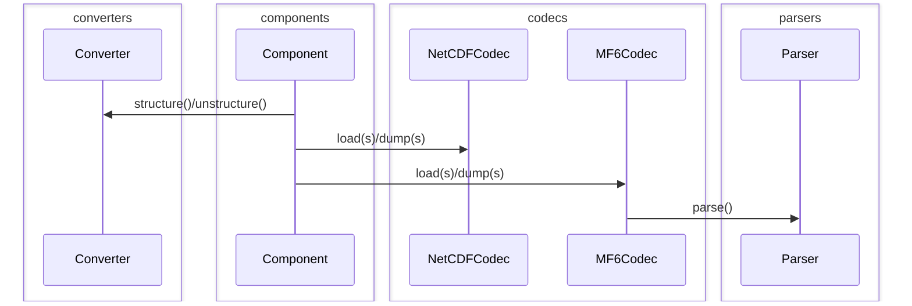

# FloPy 4 software design description (SDD)

<!-- START doctoc generated TOC please keep comment here to allow auto update -->
<!-- DON'T EDIT THIS SECTION, INSTEAD RE-RUN doctoc TO UPDATE -->

- [Basics](#basics)
  - [Variables](#variables)
- [Object model](#object-model)
    - [Dictionary mimicry](#dictionary-mimicry)
    - [Arrays](#arrays)
    - [Tables](#tables)
    - [Units](#units)
  - [Code generation](#code-generation)
  - [IO](#io)
- [Resources](#resources)

<!-- END doctoc generated TOC please keep comment here to allow auto update -->

This document records tentative design decisions taken and describes tentative architectures for FloPy 4. The focus is on the "core" &mdash; FloPy's MF6 interoperability later, and any prerequisites.

## Basics

This document follows MODFLOW 6 terminology:

- **variable**: an input variable which configures or provides data for a simulation
- **component**: a package, model, or other conceptually distinct module within a simulation

Each component contains zero or more variables. A definition file specifies a single component. Taken together, a set of definition files represents a MODFLOW 6  **input specification**, from which is generated a Python **object model** making up the `flopy.mf6` module's user-facing API.

A variable is a primitive value or a composite.

Primitive variables are scalar (int, float, bool,
string, path), array, list, or tabular.

Composite variables are product (record) or sum (union) types types, as well as lists of such.

A data model can be specified roughly as:

```python
from typing import Dict, List
from numpy.typing import ArrayLike
from pandas import DataFrame


Scalar = Union[bool, int, float, str, Path]
Record = Tuple[Scalar, ...]
Array = ArrayLike
Table = DataFrame
Param = Union[Scalar, Array, Table, Record]
```

Translating some MF6 concepts:

- An MF6 keystring can be represented as a union of
records.
- Period blocks are typically lists of unions of records and thus cannot be represented with a `DataFrame`.
- Most packages' `packagedata` blocks are tabular (regularly shaped) and can be represented with a `DataFrame`.

It should be possible to map input specifications
for a wide range of programs onto this foundation,
not only MODFLOW 6.

We recognize a distinction between two types of
parameter: configuration and data. This isn't
always valid, but it can be useful.

Options block variables (and some period block variables) might generally be considered configuration, package data variables data.

## Object model

In an ideal object model we might want things like

- a largely autogenerated API

- consistent (and few) points of entry

- easy access to a component's specification

- easy access to a component's data

- hierarchical namespacing

- validation capabilities

There are many ways to implement an object model in Python. Dictionaries, named tuples, plain classes, dataclasses...

Dataclasses are derived from an older project called
[`attrs`](https://www.attrs.org/en/stable/) which has
some extra powers, on top of the `__repr__`, structural equality, and other conveniences provided automatically, including hooks for validation and
transformation, introspection, etc.

`attrs` meets several needs out of the box:

- component introspection
- component data access
- validation hooks

A nested hierarchy of `attrs`-based classes can
form the component tree.

XArray's `DataTree` provides a nice API for accessing data variables and resolving the component's location in the hierarchy.

#### Dictionary mimicry

The dictionary is a ubiquitous data container, useful
for e.g. passing keyword arguments, and for potential
interop with 3rd-party libraries accepting dict-like
objects. It would be nice if object model components
could act like (or be easily convertible to) dicts. `attrs/cattrs` provides this capability with `asdict()` and `structure()/unstructure()`.

#### Arrays

We can accept any `numpy.typing.ArrayLike` value,
whether a standard `ndarray` or some other flavor,
so long as it acts like an array.

A common case will be lazy (e.g. dask) arrays, allowing larger-than-memory operations.

We can implement custom array-likes of our own if there is
a good case for it, e.g. constant arrays.

#### Tables

We can accept any `pd.DataFrame` (or subclass) as
tabular input.

We draw a sharp distinction between *regularly*
shaped (tabular) MF6 list input and unstructured
list input. We require these be distinguished by
type hints. The former can use `pandas` (or other library) IO routines; irregular lists need custom treatment.

#### Units

It may be worth considering support for units via e.g.
[pint](https://github.com/hgrecco/pint). Though units
are not required for MODFLOW simulations, they can be
passed through for purposes ofdocumentation, and some
other programs may require them.

### Code generation

Generated files are currently version controlled
in FloPy 3.

Code generation is a developer task, which we do
immediately before each release, or when needed
for development/modification of MF6 components.

This has the benefit that Python source files for
the MF6 input model can be inspected in an editor.
The discipline required to update them in version
control is slightly burdensome.

We have considered moving this task to install time,
and removing Python source files from versioning.
This would preserve the ability to inspect them,
while removing the question about when to update
them.

### IO

IO can be considered in several layers:

- A unified API attached to the object model
- Mapping between the object model and primitives/containers (un/structuring)
- Encoders/decoders for any number of serialization formats
- Language specification and parser for custom encodings

<br/>



## Resources

- https://docs.python.org/3/reference/datamodel.html?emulating-container-types=#emulating-generic-types
- https://docs.python.org/3/library/weakref.html
- https://www.attrs.org/en/stable/index.html#
- https://catt.rs/en/stable/index.html#
- https://docs.pydantic.dev/latest/
- https://threeofwands.com/why-i-use-attrs-instead-of-pydantic/
- https://github.com/astropy/astropy: astronomy project, nicely designed core data structures and io layer
- https://github.com/pyinat/pyinaturalist/tree/main/pyinaturalist/models: attrs for a web API client
- https://numpy.org/doc/stable/user/basics.interoperability.html: numpy interop for custom array-likes
- https://github.com/lark-parser/lark
